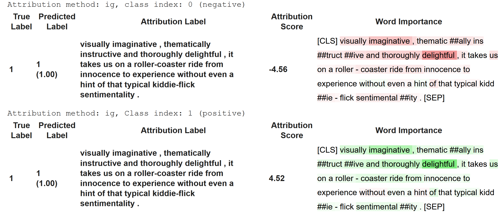
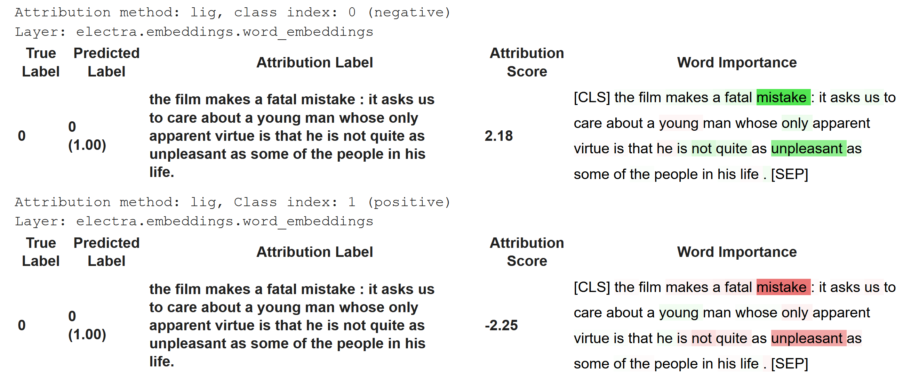
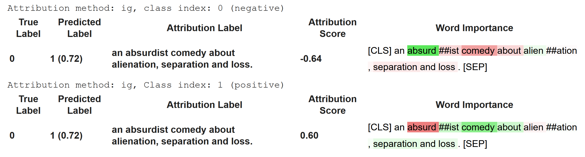
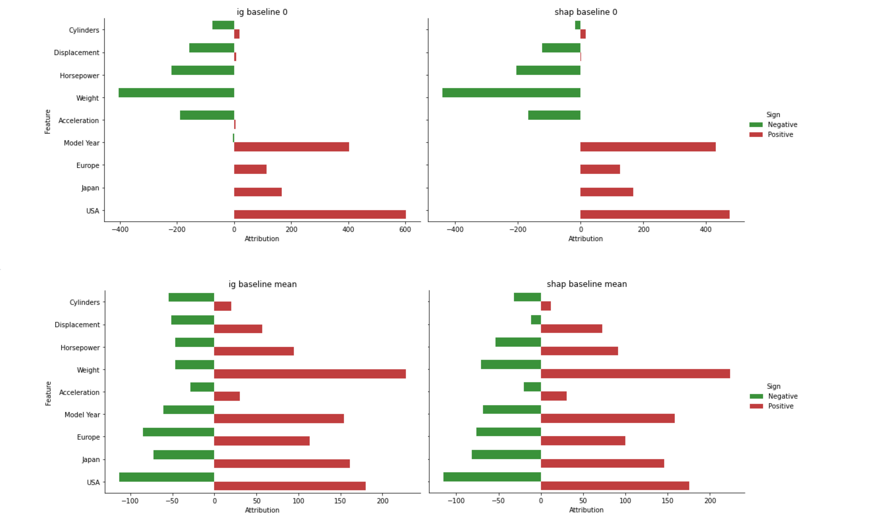

## Content
---

- <a href="#electraig-anchor">electra_fine_tune_interpret_captum_ig</a> ([notebook](electra_fine_tune_interpret_captum_ig.ipynb), [Colab notebook](https://colab.research.google.com/github/elsanns/xai-nlp-notebooks/blob/master/electra_fine_tune_interpret_captum_ig.ipynb))
- <a href="#bart-twolangs-anchor">fine_tune_bart_summarization_two_langs</a> ([notebook](fine_tune_bart_summarization_two_langs.ipynb), [Colab notebook](https://colab.research.google.com/github/elsanns/xai-nlp-notebooks/blob/master/fine_tune_bart_summarization_two_langs.ipynb))
- <a href="#captumigshapbaseline-anchor">captumig-shap-baselines</a> ([notebook](captumIg_shap_baselines.ipynb), [Colab notebook](https://colab.research.google.com/github/elsanns/xai-nlp-notebooks/blob/master/captumIg_shap_baselines.ipynb))

## <a name="electraig-anchor">Fine-tuning Electra and interpreting with Captum Integrated Gradients</a>
---

This notebook contains an example of [fine-tuning](https://huggingface.co/transformers/training.html) an [Electra](https://huggingface.co/transformers/model_doc/electra.html) model on the [GLUE SST-2](https://nlp.stanford.edu/sentiment/index.html) dataset. After fine-tuning, the [Integrated Gradients](https://arxiv.org/pdf/1703.01365.pdf) **interpretability** method is applied to compute tokens' attributions for each target class. 
* We will instantiate a pre-trained Electra model from the [Transformers](https://huggingface.co/transformers/) library. 
* The data is downloaded from the [nlp](https://huggingface.co/nlp/) library. The input text is tokenized with [ElectraTokenizerFast](https://huggingface.co/transformers/model_doc/electra.html#electratokenizerfast) tokenizer backed by HF [tokenizers](https://huggingface.co/transformers/main_classes/tokenizer.html) library.
* **Fine-tuning** for sentiment analysis is handled by the [Trainer](https://huggingface.co/transformers/main_classes/trainer.html) class. 
* After fine-tuning, the [Integrated Gradients](https://captum.ai/api/integrated_gradients.html) interpretability algorithm will assign importance scores to
input tokens. We will use a **PyTorch** implementation from the [Captum](https://captum.ai/) library. 
  - The algorithm requires providing a reference sample (a baseline) since importance attribution is performed based on the model's output, as inputs change from reference values to the actual sample. 
  - The Integrated Gradients method satisfies the **completeness** property. We will look at the sum of attributions for a sample and show that the sum approximates (explains) prediction's shift from the baseline value. 
* The final sections of the notebook contain a colour-coded **visualization** of attribution results made with *captum.attr.visualization* library.

The notebook is based on the [Hugging Face documentation](https://huggingface.co/) and the implementation of Integrated Gradients attribution methods is adapted from the Captum.ai
[Interpreting BERT Models (Part 1)](https://captum.ai/tutorials/Bert_SQUAD_Interpret).

### Visualization
Captum visualization library shows in green tokens that push the prediction towards the target class. Those driving the score towards the reference value are marked in red. As a result, words perceived as positive will appear in green if attribution is performed against class 1 (positive) but will be highlighted in red with an attribution targeting class 0 (negative).

Because importance scores ar assigned to tokens, not words, some examples may show that attribution is highly dependent on tokenization.

### Attributions for a correctly classified positive example
---

### Attributions for a correctly classified negative example
---

### Attributions for a negative sample misclassified as positive
---

  

## <a name="bart-twolangs-anchor">Fine-tuning BART for summarization in two languages</a>
---

In a world of ever-growing amount of data, the task of automatically creating coherent and fluent summaries is gaining importance. Coming up with a shorter, concise version of a document, can help to derive value from large volumes of text. 

This notebook contains an example of fine-tuning [Bart](https://huggingface.co/transformers/model_doc/bart.html) for generating summaries of article sections from the [WikiLingua](https://huggingface.co/datasets/wiki_lingua) dataset. WikiLingua is a multilingual set of articles. We will run the same code for two Bart checkpoints, including a non-English model from the [Hugging Face Model Hub](https://huggingface.co/models). We will be using:
- the **English** portion of WikiLingua with [sshleifer/distilbart-xsum-12-3](https://huggingface.co/sshleifer/distilbart-xsum-12-3) Bart checkpoint, and
- **French** articles from the WikiLingua with the [moussaKam/barthez-orangesum-abstract](https://huggingface.co/moussaKam/barthez-orangesum-abstract) model.

  

## <a name="captumigshapbaseline-anchor">Captum Integrated Gradients and SHAP for a PyTorch MPG prediction model</a>
---

This notebook contains an example of two feature attribution methods applied to a PyTorch model predicting fuel efficiency for the [Auto MPG Data Set](http://archive.ics.uci.edu/ml/machine-learning-databases/auto-mpg/auto-mpg.data). 

We will use the following methods:
- [Integrated Gradients from the Captum package](https://captum.ai/api/integrated_gradients.html)
- custom toy implementation of the [SHAP algorithm (Shapley values)](https://en.wikipedia.org/wiki/Shapley_value)

Attribution methods are applied per sample. As a result, each  feature is assigned a value reflecting its contribution to the model's output or, more precisely, to the difference between the model's output for the sample and the *expected value*. 

Both methods used in this notebook require setting a baseline, i.e.: a vector of values that will be used, for each feature, in place of a missing value. The baseline vector serves as a set of reference values that can be thought of as *neutral* and that are used to represent a missing value whenever a method requires it. We will calculate the *expected value* as model's output for a selected baseline. 

All attributions together account for the difference between the model's prediction for a sample and the expected value of the model's output for a selected baseline. 

In the examples below we will consider various baselines and see how they influence assigning importance to features.
We will see that, for each sample, attributions sum up to the difference between the model's output for the sample and the *expected value* (model's output for the baseline used to compute attributions).

### Attributions explain prediction
---

 | 
------------ | 
Attributions sum up to the difference between the model's output and the expected value (model's output for the baseline vector).

### Features and attributions
---

 | 
------------ | 
The diagrams show how high and low values of features are distributed across the range of attributions assigned by IG and SHAP for various baselines. For some features, high values of the feature (in red) correlate with high values of attributions (x-axis), for some, they gather in the lower range or there is no clear correlation.  |

### Impact of features
---

 | 
------------ | 
Accumulated feature importance varies more between baselines than it does between attribution methods. One intuitive explanation is that since both methods use a baseline to stand for a missing value, features that have close to monotonic relationship to the target will be more consistently attributed a higher absolute impact when replaced by a zero.

